class: left middle normal

# Introduction to Machine Learning
___

 
DSAA

Albert Ruiz

---
class: center middle section-title-green

## What was the first Machine Learning application?

---
class: normal

## First ML application: *the spam filter*

.center[
  
]

---
class: center middle section-title-green

## How would you code a spam filter?

---
class: normal

## Traditional approach: *the developer learns*

.center[
  
]

---
class: normal

## ML approach: *the machine learns*

.center[
  
]

---
class: center middle section-title-yellow

# What are we going to learn today?

---
class: normal

## Agenda

1. Introduction (5 min)

    * What is ML?
    * Why ML?

2. End-to-end ML (45 min)

    * Data
    * Processing
    * Feature extraction
    * Modelling
    * Results

3. Hands-on ML (*practice*, 1h)

---
class: center middle section-title-yellow

# Introduction

---
class: normal

## What is ML?

.middle-content[
Machine learning is the field of study that gives computers the *ability to learn* without being *explicitly programmed*.

[Arthur L. Samuel, 1959]
]

---
class: normal

## AI */* ML */*  DL */* DS */* BD

.center[
  
]

---
class: normal

## ML can help *humans learn*!

Some modern problems are too complex for traditional approaches:

* Problems that require fine-tuning or long list of rules

* Problems with fluctuating data

* Getting insights from large amounts of data

---
class: normal

## A wide range of use cases

* Text classification

* Sentiment analysis

* Summarizing long text

* Data extraction from images

* Fraud detection

* Chatbots

* Client segmentation

* Recommending a product to a client

* Speech recognition

* Forecasting

---
class: center middle section-title-yellow

# Common steps in a ML project

---
class: normal

## The common steps

.center[
  
]

---
class: center middle section-title-yellow

# Data

---
class: normal

.left-menu[
#### *Data*
###### Processing
###### Feature extraction
###### Modelling
###### Results
]

.right-content[
  .center[
  ## Structured */* Unstructured
  ]
  
  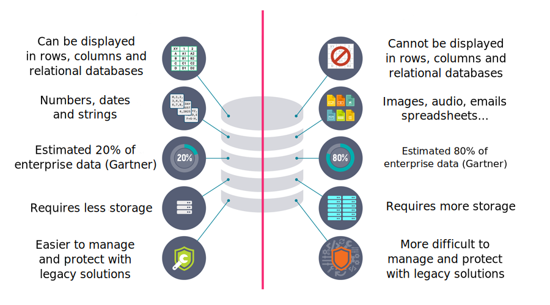
]

???

Structure data -> highly organized and formatted

---
class: normal

.left-menu[
  #### *Data*
  ###### Processing
  ###### Feature extraction
  ###### Modelling
  ###### Results
]

.right-content[
  .center[
  ## Labelled */* Unlabelled
  ]

  
]

???

Dataset -> desired solutions

---
class: normal

.left-menu[
  #### *Data*
  ###### Processing
  ###### Feature extraction
  ###### Modelling
  ###### Results
]

.right-content[
  .center[
  ## Categorical */* Quantitative
  ]

  
]

???

Quantitative variables are any variables where the data represent amounts (e.g. height, weight, or age).

Categorical variables are any variables where the data represent groups. This includes rankings (e.g. finishing places in a race), classifications (e.g. brands of cereal), and binary outcomes (e.g. coin flips).

---
class: normal

.left-menu[
  #### *Data*
  ###### Processing
  ###### Feature extraction
  ###### Modelling
  ###### Results
]

.right-content[
  .center[
  ## Invest more on data

  
  [Microsot article (2001)](https://dl.acm.org/doi/10.3115/1073012.1073017)
  ]

]

???

Microsoft famous paper -> researches showed that very different ML algorithms (including fairly simple ones) performed almost identically well on a complex NLP problem once they were given enough data.

---
class: normal

.left-menu[
  #### *Data*
  ###### Processing
  ###### Feature extraction
  ###### Modelling
  ###### Results
]

.right-content[
  .center[
  ## And use all data!
  ]

  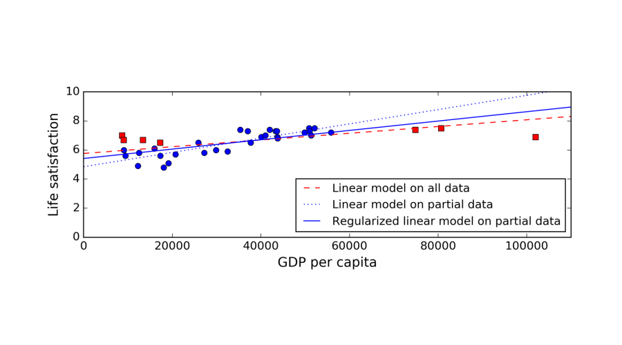
]

---
class: normal

.left-menu[
  #### *Data*
  ###### Processing
  ###### Feature extraction
  ###### Modelling
  ###### Results
]

.right-content[
  .center[
  ## Poor quality
  ]

  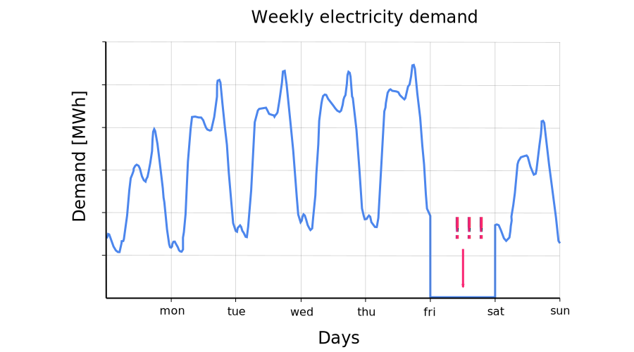
]

---
class: normal

.left-menu[
#### *Data*
###### Processing
###### Feature extraction
###### Modelling
###### Results
]

.right-content[

  .center[
  ## Use forms to improve quality
  ]

   

  |     Name      |   Surname   |  Sex   |   Birthday   | Birthplace  | Country |      Phone      |
  | :-----------: | :---------: | :----: | :----------: | :---------: | :-----: | :-------------: |
  |      Max      | Rockatasnky |   M    | *10-11-1984* |    Perth    |   AU    | +61 8 6245 2100 |
  |   Immortan    |     Joe     |  *m*   | *01-02-1949* |  Canberra   |   AU    | +61 4 1234 5678 |
  |     James     |   Connor    |   M    |  1985-02-28  | Los Angeles |  *USA*  |    *unknown*    |
  | *Alex Murphy* |             |   M    |    *1979*    |   Detroit   |   US    |      *tbc*      |
  |     John      |   McClane   |   M    |  1969-07-17  | Los Angeles |   US    |  *4242706247*   |
  |     Pete      |  Mitchell   | *MALE* |  1972-10-10  |  San Diego  |   US    |      *tbc*      |

]

---
class: center middle section-title-yellow

# Processing

---
class: normal

.left-menu[
###### Data
#### *Processing*
###### Feature extraction
###### Modelling
###### Results
]

.right-content[

  .center[
  ## Cleansing
  ]

  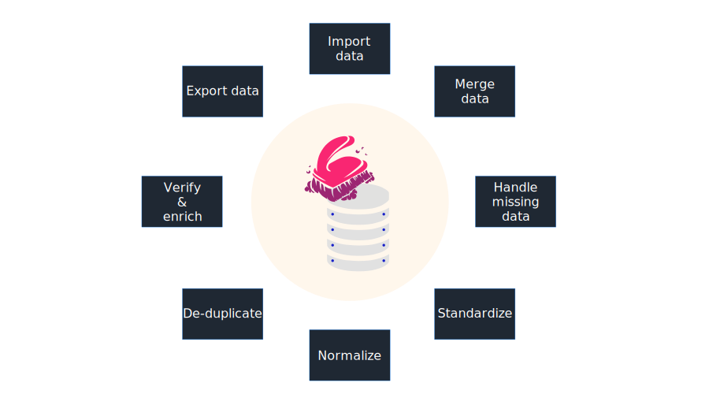

]

---
class: normal

.left-menu[
###### Data
#### *Processing*
###### Feature extraction
###### Modelling
###### Results
]

.right-content[

  .center[
  ## But... what is exactly cleansing?
  ]

   

  |      Activity       |                           Example                            |
  | :------------------ | :----------------------------------------------------------- |
  | Import              | Retrieve data from DB, files, web scraping, APIs...           |
  | Merge               | Combine data, combine tables by indexes, by column values... |
  | Handle missing data | Remove entries, substitute with similar values...            |
  | Normalize           | Numeric: Rescale values into [0, 1]                          |
  |                     | NLP: Tokenization, Lemmatization, Sentencing...              |
  | Standardize         | Rescale data to have μ = 0 and σ = 1                         |
  | De-duplicate        | Drop duplicates                                              |
  | Verify and enrich   | For dates, check dates follow the calendar and convert types |
  | Export data         | Save in a DB, in a file... (formatting) |

]

---
class: normal

.left-menu[
###### Data
#### *Processing*
###### Feature extraction
###### Modelling
###### Results
]

.right-content[

  .center[
  ## Consider removing non-representative data
  ]

  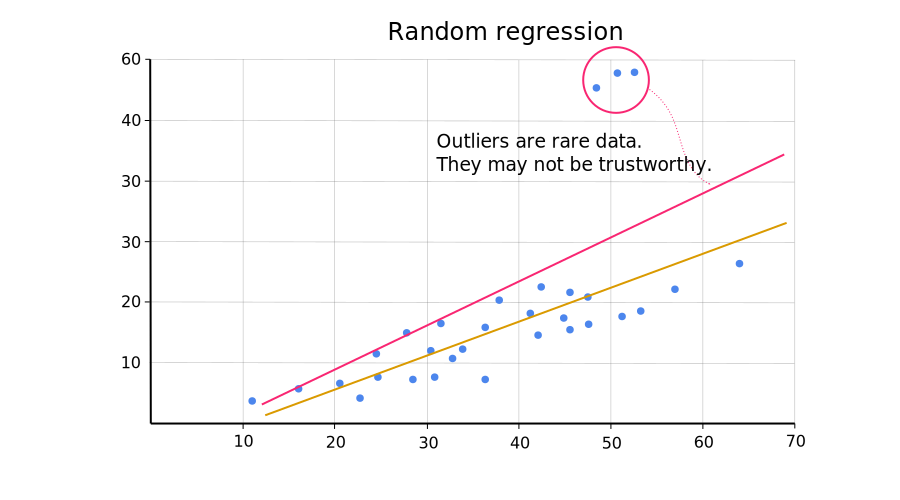

]

---
class: normal

.left-menu[
###### Data
#### *Processing*
###### Feature extraction
###### Modelling
###### Results
]

.right-content[

  .center[
  ## Consider removing outliers
  ]

  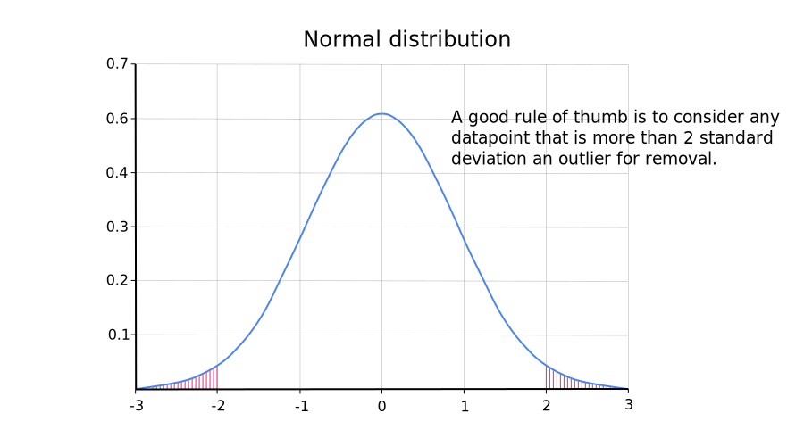

]

---
class: center middle section-title-yellow

# Feature extraction

---
class: normal

.left-menu[
###### Data
###### Processing
#### *Feature extraction*
###### Modelling
###### Results
]

.right-content[

  .center[
  ## The bridge
  ]

  

]

---
class: normal

.left-menu[
###### Data
###### Processing
#### *Feature extraction*
###### Modelling
###### Results
]

.right-content[

  .center[
  ## The "bridge" is not as it sounds...
  ]

  

]

---
class: normal

.left-menu[
###### Data
###### Processing
#### *Feature extraction*
###### Modelling
###### Results
]

.right-content[

  .center[
  ## Example: facial recognition
  ]

  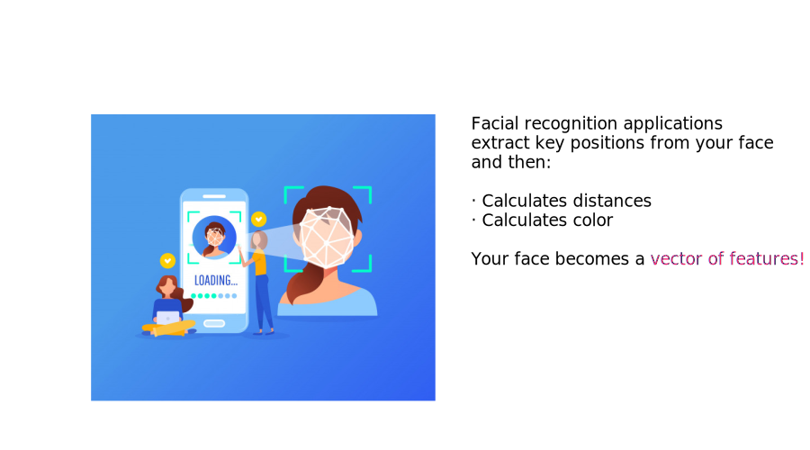

]

---
class: normal

.left-menu[
###### Data
###### Processing
#### *Feature extraction*
###### Modelling
###### Results
]

.right-content[

  ## Feature extraction applied to natural language

  Natural language text cannot be used in any algorithm as it is. It must be converted to numbers:

  There are several techniques involved

  * Tokenization
  * Lemmatization
  * Stemming
  * Vectorizers:
    * CountVectorizer
    * TfIdfVectorizer

*All these techniques will be reviewed during the hands-on session*.

]

---
class: center middle section-title-yellow

# Modelling

---
class: normal

.left-menu[
###### Data
###### Processing
###### Feature extraction
#### *Modelling*
###### Results
]

.right-content[

  .center[
  ## Supervised learning */* Unsupervised learning
  ]

  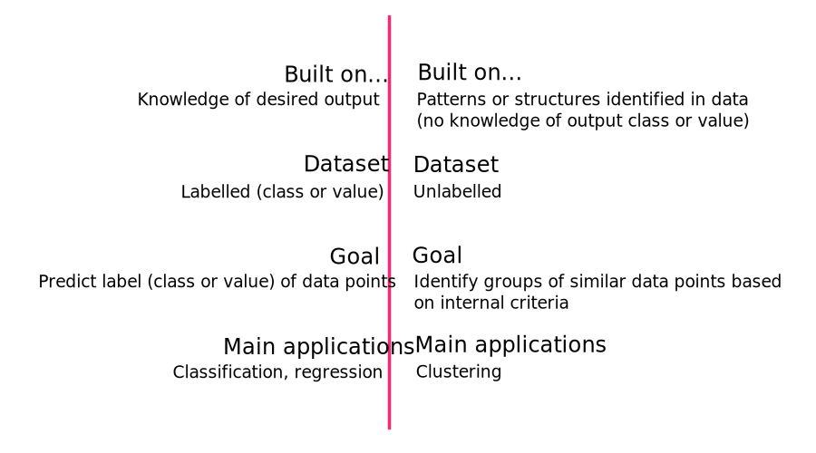

]

---
class: center middle section-title-yellow

# Supervised learning

---
class: normal

.left-menu[
###### Data
###### Processing
###### Feature extraction
#### *Modelling*
###### Results
]

.right-content[

  .center[
  ## Example of supervised learning: *the student*
  ]

  

]

---
class: normal

.left-menu[
###### Data
###### Processing
###### Feature extraction
#### *Modelling*
###### Results
]

.right-content[

  .center[
  ## Supervised learning pipeline
  ]

  

]

---
class: normal

.left-menu[
###### Data
###### Processing
###### Feature extraction
#### *Modelling*
###### Results
]

.right-content[

  .center[
  ## Under-fitting */* Robust */* Over-fitting
  ]

  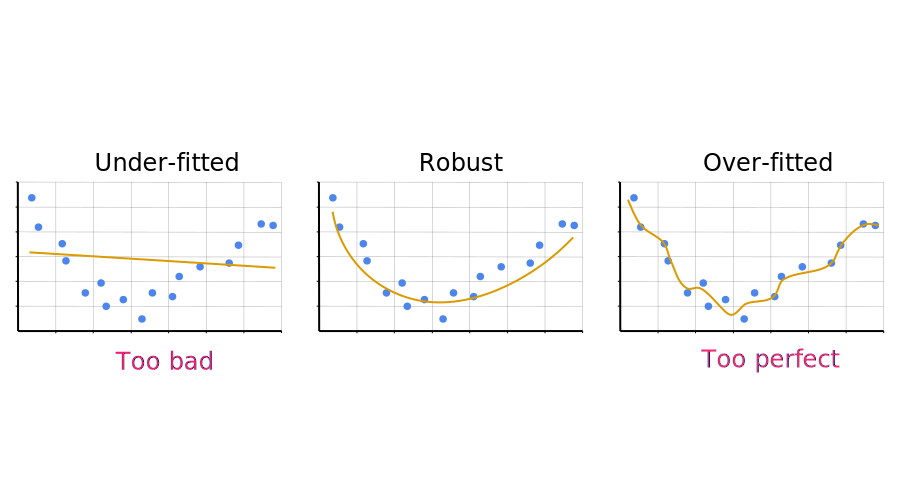

]

---
class: normal

.left-menu[
###### Data
###### Processing
###### Feature extraction
#### *Modelling*
###### Results
]

.right-content[

  .center[
  ## Some supervised learning algorithms
  ]

   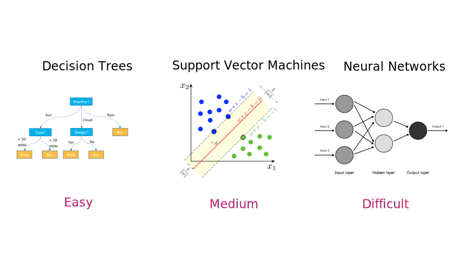

]

---
class: normal

.left-menu[
###### Data
###### Processing
###### Feature extraction
#### *Modelling*
###### Results
]

.right-content[

  .center[
  ## Decision Trees
  ]

  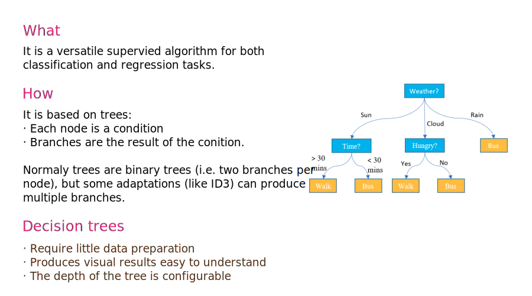

]

---
class: normal

.left-menu[
###### Data
###### Processing
###### Feature extraction
#### *Modelling*
###### Results
]

.right-content[

  .center[
  ## Support Vector Machines
  ]

  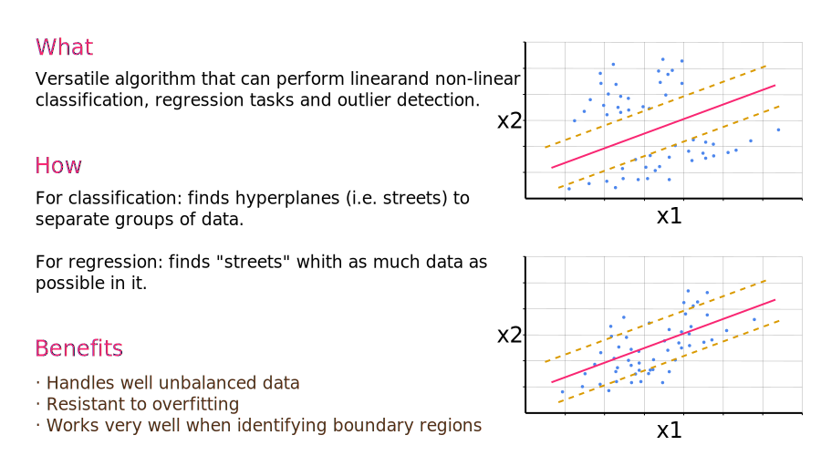

]

---
class: normal

.left-menu[
###### Data
###### Processing
###### Feature extraction
#### *Modelling*
###### Results
]

.right-content[

  .center[
  ## Neural networks
  ]

  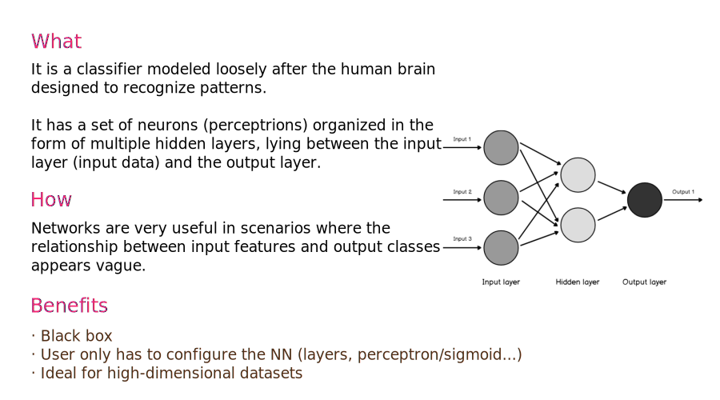

]

---
class: center middle section-title-yellow

# Unsupervised learning

---
class: normal

.left-menu[
###### Data
###### Processing
###### Feature extraction
#### *Modelling*
###### Results
]

.right-content[

  .center[
  ## Example of supervised learning: *clustering video-games clients*
  ]

  

]

---
class: normal

.left-menu[
###### Data
###### Processing
###### Feature extraction
#### *Modelling*
###### Results
]

.right-content[

  .center[
  ## Unsupervised learning pipeline
  ]

  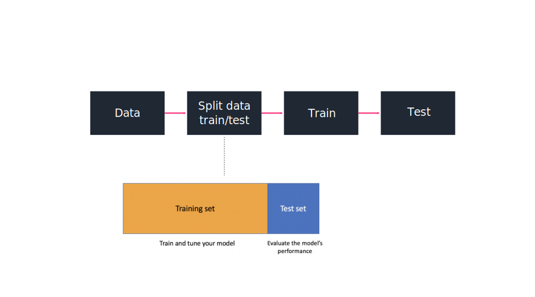

]

---
class: normal

.left-menu[
###### Data
###### Processing
###### Feature extraction
#### *Modelling*
###### Results
]

.right-content[

  .center[
  ## Clustering
  ]

  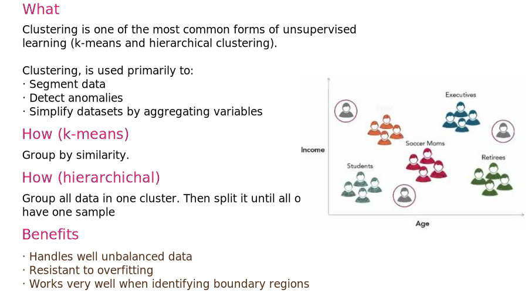

]

---
class: center middle section-title-yellow

# Results

---
class: normal

.left-menu[
###### Data
###### Processing
###### Feature extraction
###### Modelling
#### *Results*
]

.right-content[

  .center[
  ## Results
  ]

  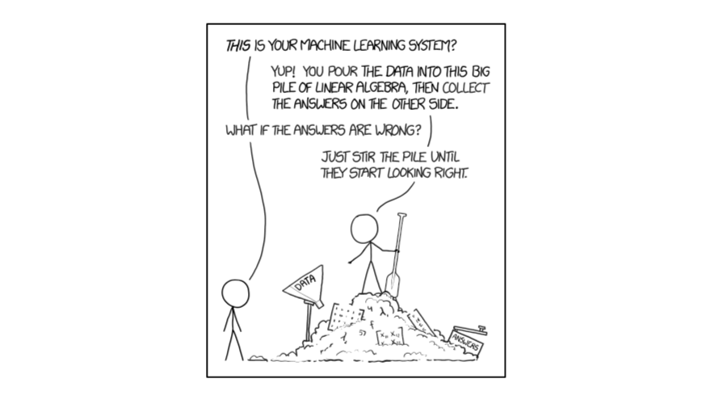

]

---
class: center middle section-title-yellow

# Hands-on ML (practice)

---
class: center middle normal

Go to:

https://colab.research.google.com

---
class: center middle section-title-orange

## Questions?
#### (albert.ruizalvarez@zurich.com)

---
class: center middle section-title-dark

## Thank you!