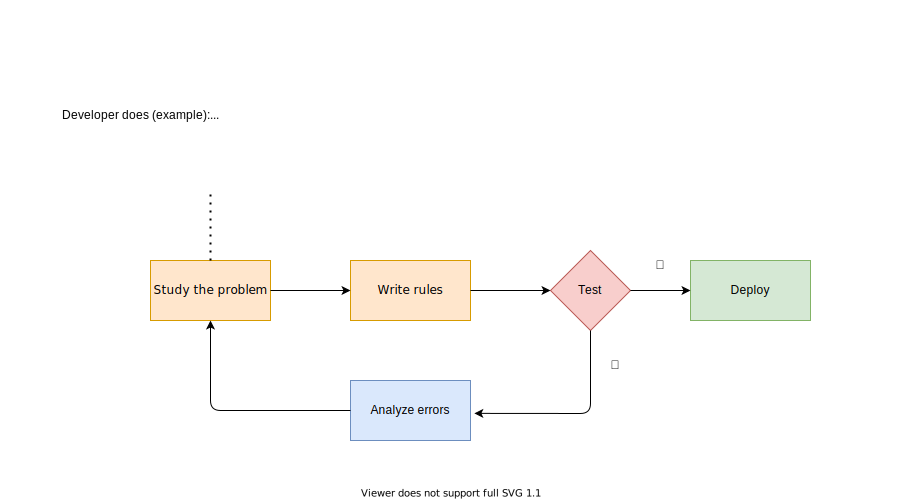
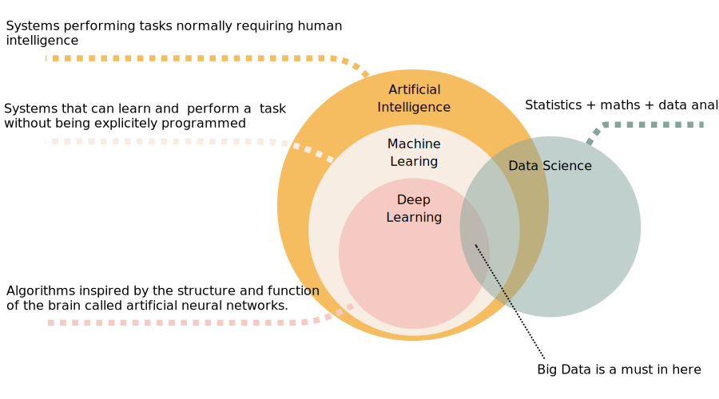
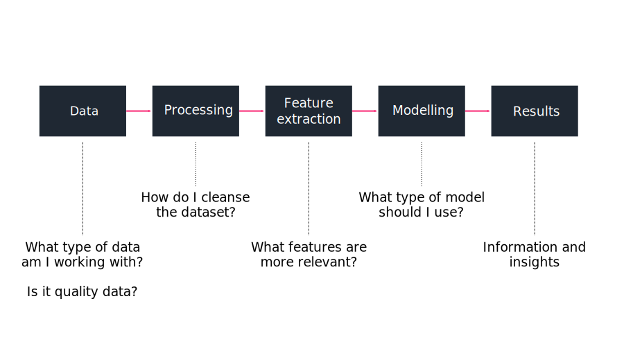

class: left, middle

# Introduction to Machine Learning
___

 
Albert Ruiz

---
class: center middle section-title-green

## What was the first Machine Learning application?

---
## First ML application: *the spam filter*

.center[
  
]

---
class: center middle section-title-green

## How would you code a spam filter?

---
## Traditional approach: *the developer learns*

.center[
  
]

---
## ML approach: *the machine learns*

.center[
  
]

---
class: center middle section-title-yellow

# What are we going to learn today?

---
## Agenda

1. Introduction (5 min)

    * What is ML?
    * Why ML?
    * ML in insurance

2. End-to-end ML (45 min)

    * Data
    * Processing
    * Vectorization
    * Modelling
    * Visualization

3. Hands-on ML (*practice*, 1h)

---
class: center middle section-title-yellow

# Introduction

---
## What is ML?

.middle-content[
Machine learning is the field of study that gives computers the *ability to learn* without being *explicitely programmed*.

[Arthur L. Samuel, 1959]
]

---
## AI */* ML */*  DL */* DS */* BD

.center[
  
]

---
## ML can help *humans learn*!

Some modern problems are too complex for traditional approaches:

* Problems that require fine-tuning or long list of rules

* Problems with fluctuating data

* Getting insights from large amounts of data

---
## A wide range of use cases

* Text classification

* Sentiment analyisis

* Summarizing long text

* Data extraction from images

* Fraud detection

* Chatbots

* Client segmentation

* Recommending a product to a client

* Speech recognition

* Forecasting

---
## ML applied to the insurance sector

---
class: center middle section-title-yellow

# Common steps in a ML project

---
## The common steps

.center[
  
]

---
.left-menu[
#### *Data*
###### Processing
###### Vectorization
###### Modelling
###### Visualization
]

.right-content[
  ## Structured */* Unstructured

  #### Structured data

  * Well defined interface to access data

  * Data is formatted

  * *SQL*, *XML*, *HTML*, *JSON*, *XLSX*, *CSV*, *PNG*...

  #### Unstructured data

  * No predefined interface to access data

  * No predefined format

  * *PDF*, *TXT*, *TEX*, *MD*...
]

???

Structure data -> highly organized and formatted

---
.left-menu[
#### *Data*
###### Processing
###### Vectorization
###### Modelling
###### Visualization
]

.right-content[
  ## When structured isn't structured

   
   

  |    name     |   surname   |  sex  | birthdate  | birthplace  | country |      phone      |
  | :---------: | :---------: | :---: | :--------: | :---------: | :-----: | :-------------: |
  |     Max     | Rockatasnky |   M   | 10-11-1984 |    Perth    |   AU    | +61 8 6245 2100 |
  |  Immortan   |     Joe     |   m   | 01-02-1949 |  Canberra   |   AU    | +61 4 1234 5678 |
  |    James    |   Connor    |   M   | 1985-02-28 | Los Angeles |   USA   |     unknown     |
  | Alex Murphy |             |   M   |    1979    |   Detroit   |   US    |       tbc       |
  |    John     |   McClane   |   M   | 1969-07-17 | Los Angeles |   US    |   4242706247    |
  |    Pete     |  Mitchell   | MALE  | 1972-10-10 |  San Diego  |   US    |       tbc       |

]

---
.left-menu[
  #### *Data*
  ###### Processing
  ###### Vectorization
  ###### Modelling
  ###### Visualization
]

.right-content[
  ## Labelled */* Unlabelled

  Labelled datasets include the desired solutions (*labels*), used in supervised learning.

  
]

---
## Labelled */* Unlabelled

Labelled datasets include the desired solutions (*labels*), used in supervised learning

.footnote[asdf]

---
.left-menu[
  #### *Data*
  ###### Processing
  ###### Vectorization
  ###### Modelling
  ###### Visualization
]

.right-content[
  ## Categorical */* Quantitative
]

---
.left-menu[
  #### *Data*
  ###### Processing
  ###### Vectorization
  ###### Modelling
  ###### Visualization
]

.right-content[
  ## Training dataset */* Testing dataset
]

---
.left-menu[
  #### *Data*
  ###### Processing
  ###### Vectorization
  ###### Modelling
  ###### Visualization
]

.right-content[
  ## Insuficient quantity of training data
]

---
.left-menu[
  #### *Data*
  ###### Processing
  ###### Vectorization
  ###### Modelling
  ###### Visualization
]

.right-content[
  ## Non-representative training data
]

---
.left-menu[
  #### *Data*
  ###### Processing
  ###### Vectorization
  ###### Modelling
  ###### Visualization
]

.right-content[
  ## Poor quality
]

---
class: center middle section-title-yellow

# Hands-on ML (practice)

---
class: center middle section-title-orange

## Questions?
#### (albert.ruizalvarez@zurich.com)

---
class: center middle section-title-dark

## Thank you!